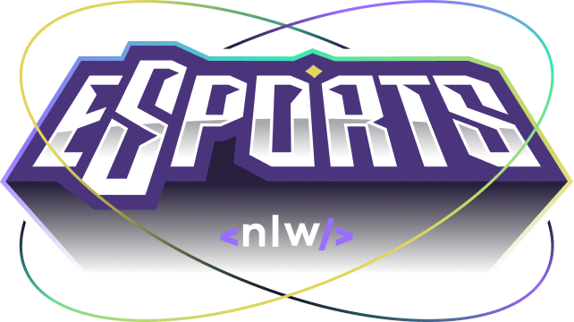
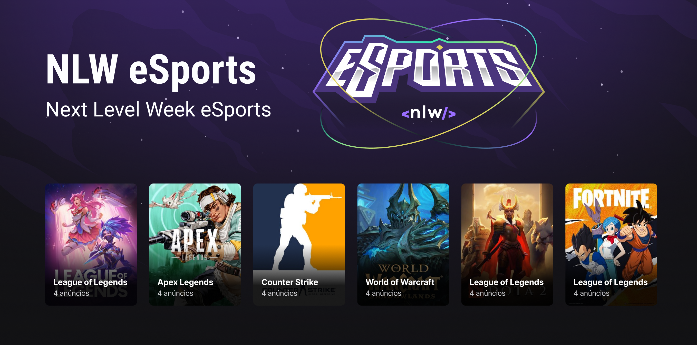

<p align="center">
  
</p>

<p align="center">
  

       

  
</p>

<h1 align="center">
    
</h1>

<br>

## 🧪 Technologies

This project was developed using the following technologies:

- [React JS](https://reactjs.org)
- [Vite](https://vitejs.dev)
- [TailWindCss](https://tailwindcss.com)
- [Radix Ui](https://www.radix-ui.com)
- [TypeScript](https://www.typescriptlang.org)  

## 🚀 Getting started

Clone the project and access the folder.

```bash
$ git clone https://github.com/JeffyMesquita/NLWeSports-web.git
```


Follow the steps below:
```bash
# Install the dependencies
$ yarn install
# or
$ npm i
# Start the project
$ yarn dev
```

## 🔖 Layout

You can view the project layout through the links below:

- [Layout](https://www.figma.com/file/EUgvN1dzqeyCwS5rY9sjsA/NLW-eSports-Community) 

Remembering that you need to have a [Figma](http://figma.com/) account to access it.

## 📝 License

This project is licensed under the MIT License. See the [LICENSE](LICENSE) file for details.

---

Made with :heartpulse: by [jeffymesquita](...) 👋
